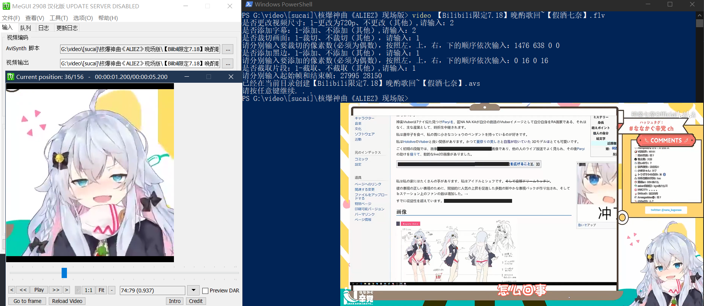

# videoProcess
---
主要功能：后期视频压制avs脚本的生成
### 目前的功能
运行实例：
>

输入的文件路径为 
> G:\video\[sucai]\核爆神曲《ALIEZ》现场版\《ALIEZ》 现场版.mp4

生成的`《ALIEZ》 现场版.avs`中的内容
```
LoadPlugin("D:\Programs\MeGUI\tools\ffms\ffms2.dll")
LoadPlugin("D:\Programs\MeGUI\tools\avisynth_plugin\VSFilter.dll")
video=FFVideoSource("G:\video\[sucai]\核爆神曲《ALIEZ》现场版\《ALIEZ》 现场版.mp4").LanczosResize(1280,720).TextSub("G:\video\[sucai]\核爆神曲《ALIEZ》现场版\《ALIEZ》 现场版.ass")
audio=FFAudioSource("G:\video\[sucai]\核爆神曲《ALIEZ》现场版\《ALIEZ》 现场版.mp4")
AudioDub(video,audio)
trim(234,324)

```
只适用于在`简体中文windows`环境下，编码方式为`GBK`，相信能满足一部分人的后期需求，`LanczosResize`更改分辨率，当前默认更改为720p,`TextSub`添加字幕（字幕需要在同文件夹下，与视频同名），`trim(234,324)` 裁取 234-324 帧。

### 使用方式
配合MEGUI使用，直接将生成的avs脚本拖入即可
